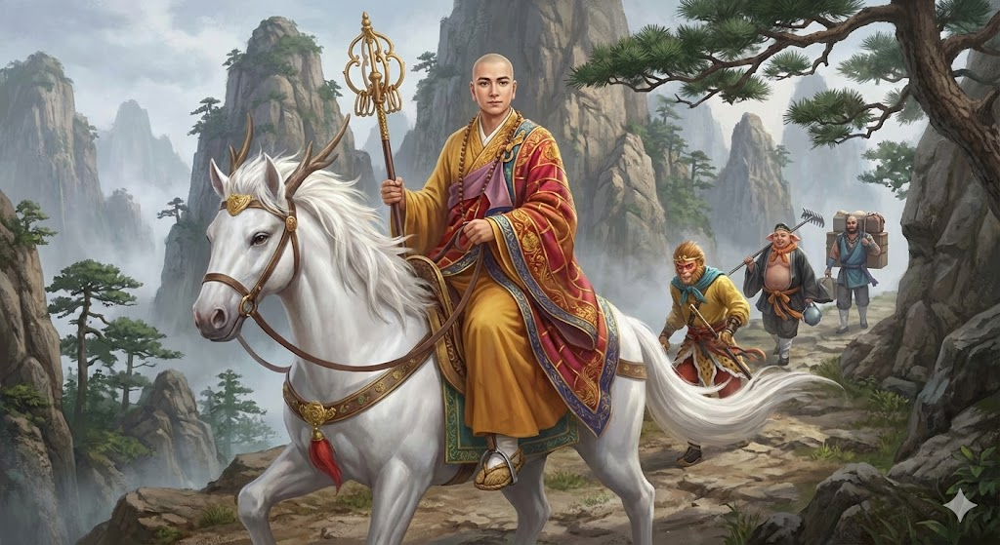
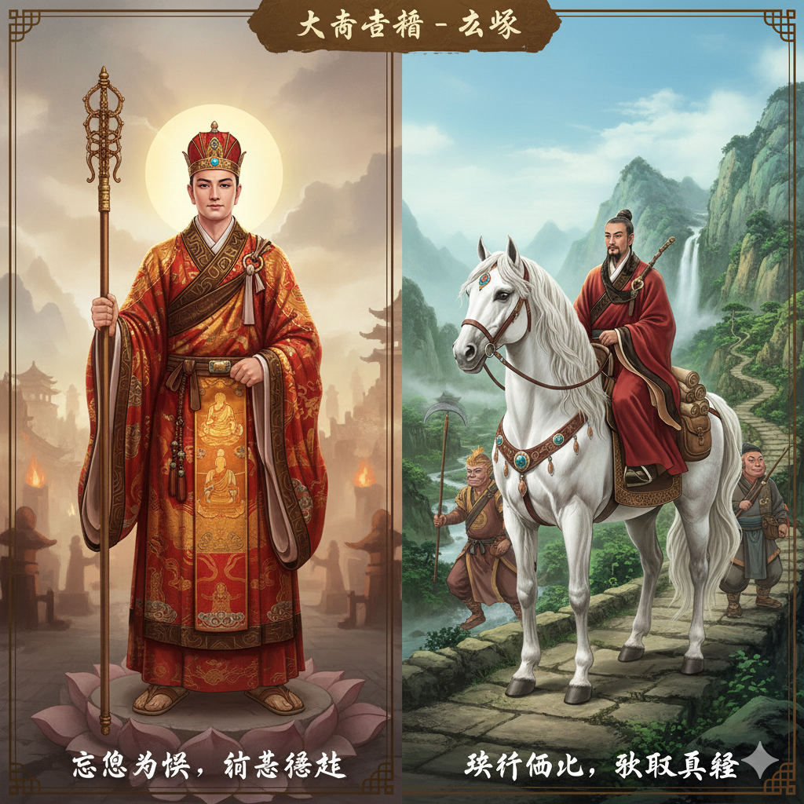
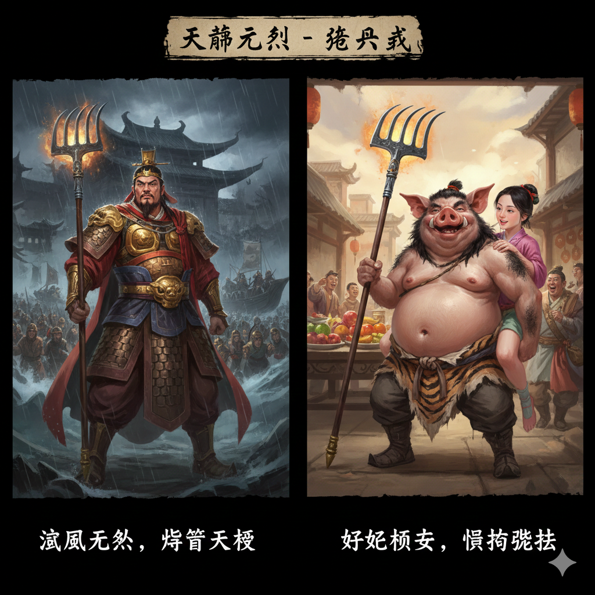
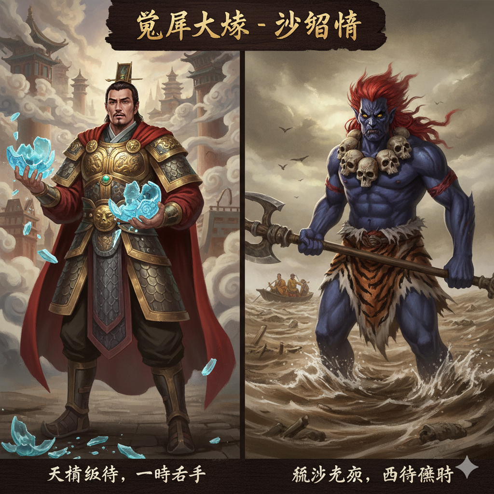
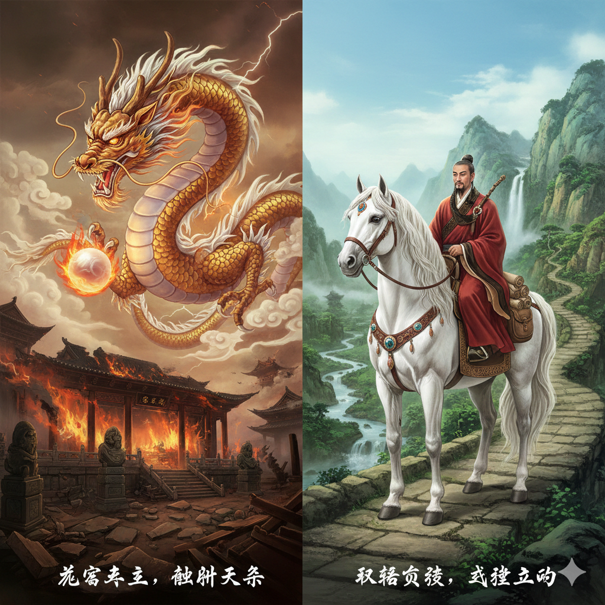

# 🐉 西游记取经团队

## 🖼️ 团队形象



*唐僧师徒四人一马，历经九九八十一难，西天取经的传奇团队*

---

## 📋 团队成员目录

| 角色 | 身份 | 特点 | 图片 | 详细资料 |
|------|------|------|------|----------|
| **唐僧** | 金蝉子转世，大唐御弟 | 慈悲为怀，意志坚定 |  | [查看详情](唐僧.md) |
| **孙悟空** | 齐天大圣，美猴王 | 机智勇敢，调皮捣蛋 |  | [查看详情](孙悟空.md) |
| **猪八戒** | 天蓬元帅转世 | 贪吃好色，憨厚可爱 |  | [查看详情](猪八戒.md) |
| **沙僧** | 卷帘大将转世 | 忠厚老实，任劳任怨 |  | [查看详情](沙僧.md) |
| **白龙马** | 西海龙王三太子 | 低调隐忍，忠诚可靠 |  | [查看详情](白龙马.md) |

---

## 🎭 团队角色分析

### 🔥 战斗核心 - 孙悟空
- **职责**：主要战力，降妖除魔
- **特点**：七十二变，筋斗云，金箍棒
- **贡献**：解决大部分战斗难题

### 🍖 幽默调节 - 猪八戒  
- **职责**：辅助战斗，团队润滑
- **特点**：九齿钉耙，变化能力
- **贡献**：提供喜剧元素，调节气氛

### 🧳 后勤保障 - 沙僧
- **职责**：行李担当，稳定支持
- **特点**：降妖宝杖，稳重可靠
- **贡献**：默默奉献，调和矛盾

### 🐎 交通支持 - 白龙马
- **职责**：坐骑，交通保障
- **特点**：龙马精神，关键时刻助战
- **贡献**：驮行十万八千里

### 🙏 精神领袖 - 唐僧
- **职责**：团队核心，信念象征
- **特点**：慈悲为怀，意志坚定
- **贡献**：保持取经信念不动摇

---

## 📖 取经历程概览

### 🚶‍♂️ 行程路线
```
长安出发 → 五行山收悟空 → 高老庄收八戒 → 流沙河收沙僧 → 鹰愁涧收白龙马
    ↓
历经九九八十一难 → 西天雷音寺 → 取得真经 → 返回长安 → 功德圆满
```

### ⏱️ 时间跨度
- **总时长**：14年
- **总路程**：十万八千里
- **磨难数量**：九九八十一难
- **取得经书**：35部，5048卷

---

## 🌟 团队协作模式

### 🤝 分工合作
```
取经团队运作机制：
唐僧(决策) ← 孙悟空(执行) ← 猪八戒(辅助) ← 沙僧(支持) ← 白龙马(后勤)
    │           │           │           │           │
精神指导    主要战力    幽默调节    稳定保障    交通支持
```

### 💪 优势互补
- **孙悟空**：战斗力强，但冲动
- **猪八戒**：幽默调节，但懒惰  
- **沙僧**：稳重可靠，但低调
- **白龙马**：默默奉献，但少言
- **唐僧**：信念坚定，但迂腐

---

## 🔗 快速导航

### 📚 人物详细资料
- [唐僧详细资料](唐僧.md) - 金蝉子转世，慈悲为怀
- [孙悟空详细资料](孙悟空.md) - 齐天大圣，机智勇敢
- [猪八戒详细资料](猪八戒.md) - 天蓬元帅，憨厚可爱
- [沙僧详细资料](沙僧.md) - 卷帘大将，忠厚老实
- [白龙马详细资料](白龙马.md) - 龙王三太子，忠诚可靠

### 🗺️ 相关目录
- [返回人物资料库主目录](../README.md)
- [查看天庭系统人物](../神仙佛祖/README.md)
- [查看西天佛界人物](../西天佛界/README.md)
- [查看妖怪精怪人物](../妖怪精怪/README.md)

---

## 💡 现代启示

### 🏢 团队建设
- **唐僧** → 愿景领导者
- **孙悟空** → 技术骨干
- **猪八戒** → 氛围营造者
- **沙僧** → 后勤支持者
- **白龙马** → 基础设施

### 🌱 个人成长
- 从叛逆到成熟（孙悟空）
- 从缺点到优点（猪八戒）
- 从默默到重要（沙僧）
- 从罪人到功德（白龙马）
- 从凡人到佛（唐僧）

---

*最后更新：2025年*  
*资料基于《西游记》原著整理*