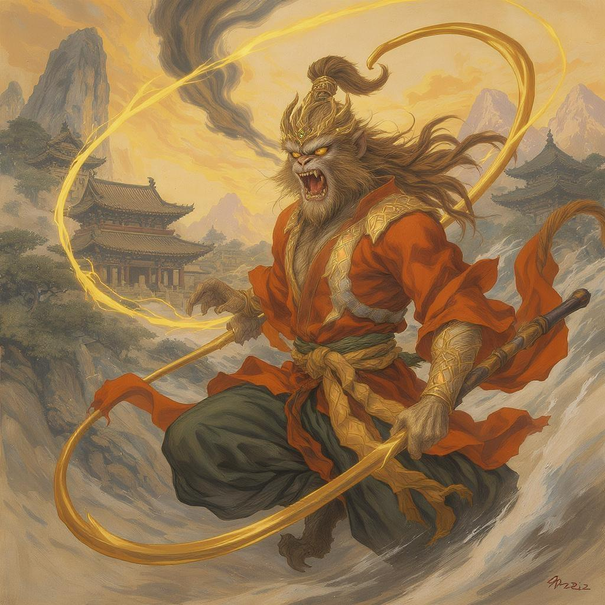

# 孙悟空

## 🖼️ 人物形象



*孙悟空标准形象：金睛火眼，毛脸雷公嘴，虎皮裙，金箍棒*

## 基本身份
- **称号**：齐天大圣、美猴王、斗战胜佛
- **出身**：由开天辟地以来的仙石孕育而生
- **师承**：菩提祖师（学会七十二变、筋斗云等法术）
- **武器**：如意金箍棒（重一万三千五百斤）
- **主要经历**：花果山称王、大闹龙宫、大闹地府、大闹天宫、被压五行山、保护唐僧取经

## 性格特点
1. **机智勇敢**：善于变化，智斗妖魔
2. **调皮捣蛋**：天性顽皮，不拘天规
3. **忠诚护主**：对唐僧忠心耿耿，虽有矛盾但不离不弃
4. **自尊心强**：重视名号，自称"齐天大圣"
5. **嫉恶如仇**：对妖怪毫不留情

## 象征意义
- **反抗精神**：挑战权威，追求自由
- **智慧勇气**：克服困难的智慧与勇气
- **成长历程**：从顽劣到成熟的心路历程

## 经典形象
- 雷公嘴、孤拐面、火眼金睛
- 虎皮裙、金箍棒、筋斗云
- 常说口头禅："俺老孙来也！"

## 经典片段
### 大闹天宫偷仙桃
孙悟空被玉帝封为"齐天大圣"后，派去管理蟠桃园。这猴王见了满园仙桃，馋虫大动。他支开土地神和力士，独自爬上桃树，专拣那熟透的、又大又红的桃子，左一个右一个，吃得满嘴流汁。吃饱了就在树上打盹，醒来继续吃，把个蟠桃园祸害得不成样子。

### 三打白骨精
白骨精三次变化来骗唐僧，都被孙悟空识破打死。唐僧肉眼凡胎，不识妖怪，反而责怪孙悟空滥杀无辜，念紧箍咒惩罚他。孙悟空疼得满地打滚，但仍坚持除妖。最后唐僧写下贬书，赶走孙悟空。

### 智取芭蕉扇
孙悟空为过火焰山，向铁扇公主借芭蕉扇。第一次被扇飞五万里，第二次变作小虫钻入茶中，被喝下肚，在肚子里拳打脚踢，逼她借扇。第三次变作牛魔王骗到真扇，却又被牛魔王变作猪八戒骗回。

## 文化影响
1. **中国版"超级英雄"**：代表反抗与正义
2. **智慧象征**：七十二变体现无穷智慧
3. **成长典范**：从叛逆到成熟的修行之路
4. **文化符号**：中国传统文化的重要代表

## 相关成语俗语
- "孙悟空翻不出如来佛的手掌心"
- "猴精猴精的"
- "齐天大圣"（比喻本事大、不服管的人）

## 现代启示
- **团队中的核心力量**：有能力、有担当
- **智慧解决问题**：用智慧而非蛮力
- **忠诚与成长**：在矛盾中保持忠诚，在磨难中成长

---

# 🐒 孙悟空人物图谱

## 📊 基本信息图谱
```
身份演变：仙石化猴 → 花果山美猴王 → 菩提祖师弟子 → 齐天大圣 → 五行山囚徒 → 取经护法 → 斗战胜佛
特点分析：机智勇敢(90%) | 调皮捣蛋(85%) | 忠诚护主(88%) | 自尊心强(92%) | 嫉恶如仇(95%)
```

## 🔄 成长历程图谱
```
仙石孕育 → 花果山称王 → 拜师学艺 → 大闹三界 → 五行山镇压 → 取经护法 → 修成正果
    ↓           ↓           ↓           ↓           ↓           ↓           ↓
天真顽皮 → 建立权威 → 掌握神通 → 挑战秩序 → 反思顿悟 → 忠诚守护 → 智慧圆满
```

## 🎭 角色定位分析
```
取经团队结构：
┌─ 孙悟空（战斗主力/智慧担当）
├─ 猪八戒（幽默调节/后勤辅助）  
├─ 沙僧（稳定支持/行李担当）
└─ 白龙马（交通保障/默默奉献）
    ↑
唐僧（精神领袖/信念核心）
```

## 📖 经典场景时间轴
```
大闹天宫(叛逆期) → 五行山镇压(反思期) → 三打白骨精(忠诚考验) → 智取芭蕉扇(智慧巅峰) → 修成正果(圆满期)
```

## 🌟 象征意义网络
```
孙悟空 = 反抗精神 + 无穷智慧 + 忠诚品质 + 成长历程
    ↓           ↓           ↓           ↓
挑战权威    七十二变    护主心切    从顽劣到成熟
```

## 🔗 人际关系图谱
```
        唐僧（师父/严师）
           │
    ┌───┬───┼───┬───┐
    │   │   │   │   │
孙悟空  猪八戒  沙僧  白龙马
（大师兄）（二师兄）（三师兄）（坐骑）
    │       │       │       │
战友关系  竞争关系  合作关系  支持关系
```

## 💡 现代启示映射
| 原著品质 | 现代对应 | 应用场景 |
|---------|---------|---------|
| 机智勇敢 | 创新思维 | 职场问题解决 |
| 忠诚护主 | 团队精神 | 项目合作担当 |
| 挑战权威 | 改革精神 | 制度创新突破 |
| 七十二变 | 适应能力 | 多变环境生存 |

## 🎨 人物形象参考图
[图片描述：孙悟空形象参考]
- **标准形象**：金睛火眼，毛脸雷公嘴，身穿虎皮裙，手持金箍棒
- **战斗姿态**：腾云驾雾，挥舞金箍棒，气势如虹
- **变化形态**：可变化为飞虫、树木、人物等七十二种形态
- **表情特征**：机智狡黠的眼神，自信满满的笑容

[返回人物资料库](README.md)