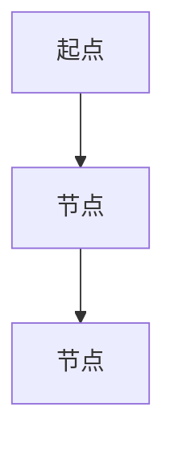
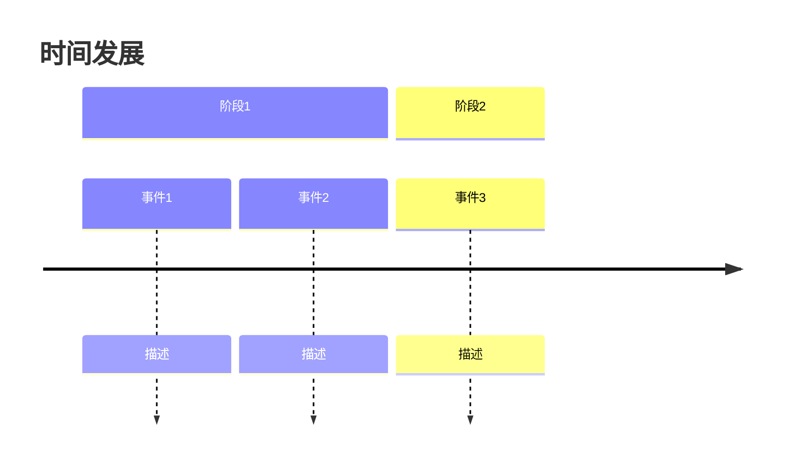

# 世界观输出模板

## 1. 简洁模板
```
## [元素名称]

**所属体系**：[体系名称]
**主要特点**：[简要描述]
**重要关联**：[关联元素]
```

## 2. 详细模板
```
# [元素名称]

## 概述
[总体描述]

## 详细解析
- **起源**：[起源说明]
- **特点**：[特点列表]
- **功能**：[功能描述]
- **规则**：[运作规则]

## 关联网络
- **上级元素**：[上级关系]
- **同级元素**：[同级关系]
- **下级元素**：[下级关系]

## 文化寓意
[文化象征意义]

## 现代应用
[在现代创作中的应用]
```

## 3. 图谱模板
```
# 🗺️ [体系名称]图谱

## 结构图
[体系层级结构]

## 等级划分
| 等级 | 名称 | 特点 | 代表 |
|------|------|------|------|
| [数据行] | ... | ... | ... |

## 关系网络


## 时间线


## 4. 比较模板
```
## [元素A] vs [元素B]

| 方面 | [元素A] | [元素B] |
|------|---------|---------|
| 起源 | ... | ... |
| 特点 | ... | ... |
| 功能 | ... | ... |
| 等级 | ... | ... |
```

## 5. 故事模板
```
## [元素名称]的故事

**背景**：[故事背景]
**事件**：[主要事件]
**转折**：[关键转折]
**结局**：[最终结果]
**寓意**：[故事寓意]
```

## 使用说明

### 选择模板
1. **快速查询**：使用简洁模板
2. **深入研究**：使用详细模板
3. **系统分析**：使用图谱模板
4. **对比分析**：使用比较模板
5. **叙述呈现**：使用故事模板

### 填充指南
- 保持信息准确，基于《西游记》原著
- 注意元素间的逻辑关系
- 揭示文化寓意和哲学思想
- 提供现代应用价值

### 输出格式
- Markdown：通用格式
- JSON：结构化数据
- 文本：纯文字叙述
- 图表：可视化呈现